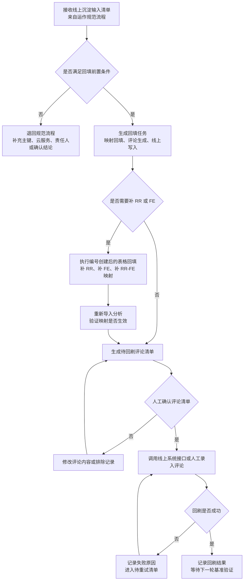

# 需求回填动作执行说明

## 1. 定位

本文说明需求对齐完成后的具体执行动作，包括 Excel 回填、RR-FE 映射回填、待回刷评论清单生成、线上系统评论写入和闭环验证。

本文不替代 [需求管理运作规范](./需求管理运作规范.md)。运作规范负责定义团队应该如何管理需求、谁负责确认、什么条件算合规；本文负责定义在合规结论已经形成后，工具和执行人如何把结论回填到表格或线上系统。

边界：

1. 运作规范决定“是否应该沉淀”。
2. 回填动作决定“如何执行沉淀”。
3. 回填动作不能绕过运作规范中的准入、禁止和遵从性要求。
4. 当前阶段线上系统只写评论，不直接更新状态、排期、负责人等结构化字段。

## 2. 回填动作分类

| 动作 | 触发条件 | 执行对象 | 主责人 | 输出 |
| --- | --- | --- | --- | --- |
| Excel 映射回填 | RR 已创建、FE 已创建或 RR-FE 关系已确认 | 来源列表、待建 FE 清单、待创建 RR 清单 | 产品经理 | 更新后的编号映射和处理状态。 |
| 待回刷评论生成 | 对齐结论已确认，且满足线上沉淀准入 | 工具导出的待回刷评论清单 | 产品经理 | 待回刷评论清单。 |
| 线上评论回刷 | 待回刷评论清单通过人工确认 | 线上系统 FE 或 RR | 产品经理或系统执行人 | 线上系统评论记录。 |
| 回刷结果校验 | 评论回刷完成后 | 线上系统和下一轮基准表 | 产品经理 | 成功记录、失败记录、待重试记录。 |

## 3. 总体动作流程



## 4. 回填前置条件

执行任何回填动作前，必须满足以下条件：

| 条件 | 要求 | 不满足时处理 |
| --- | --- | --- |
| 主键明确 | 至少有 FE编号 或 RR编号 | 退回补充主键；无法补充时不回填。 |
| 云服务明确 | 需求必须有云服务 | 补充云服务或使用显式默认值填充。 |
| 结论已确认 | 结论经过产品经理和相关责任人确认 | 退回对齐流程。 |
| 责任人明确 | 风险、下一步动作、依赖服务计划必须有责任人 | 补充责任人后再执行。 |
| 目标对象明确 | 明确写 FE、RR，或写当前对象加一层关联对象 | 未确认时默认只写当前对象。 |
| 异常已处理 | 不存在阻断类异常 | 先处理异常，不执行回填。 |

## 5. Excel 映射回填动作

### 5.1 适用场景

Excel 映射回填用于把新创建或新确认的编号关系补回表格，使下一次分析能够稳定关联。

适用场景：

1. `RR编号` 有值但 `FE编号` 为空，内部已经创建 FE。
2. 外部诉求已经创建 RR，需要把 RR 补回来源列表。
3. 一个 RR 拆成多个 FE，需要明确 RR-FE 拆分关系。
4. 多个 RR 合并到一个 FE，需要明确多个 RR 和同一个 FE 的关系。
5. 工具识别到 FE 候选，人工确认后需要补齐映射。

### 5.2 回填字段

| 字段 | 是否必填 | 说明 |
| --- | --- | --- |
| 来源列表 | 必填 | 原始文件名，用于定位来源。 |
| 来源行号 | 必填 | 原始 Excel 行号。 |
| 云服务 | 必填 | 用于辅助确认服务归属。 |
| RR编号 | 条件必填 | 外部需求编号。外部诉求必须填写。 |
| FE编号 | 条件必填 | 内部交付编号。进入研发排期必须填写。 |
| 处理状态 | 必填 | 待创建RR、待建FE、已回填、无需创建、待确认。 |
| 处理说明 | 建议填写 | 说明为什么创建或不创建。 |

### 5.3 执行规则

1. 回填前必须保留原始来源文件，不覆盖原始数据。
2. 回填后的映射应生成新的处理结果文件或导入回工具，不建议直接覆盖项目经理原始文件。
3. 回填完成后必须重新导入分析，确认异常项已消除。
4. 如果回填后仍出现 RR 关联异常或云服务冲突，应退回运作规范流程重新确认。
5. 回填映射只解决编号关系，不代表状态、排期或风险已经确认。

## 6. 待回刷评论生成动作

### 6.1 输入

待回刷评论生成依赖以下输入：

1. 线上沉淀输入清单。
2. 评论目标：FE、RR，或当前对象加一层关联对象。
3. 评论字段配置，例如对齐结论、会议纪要、风险、客户影响、备注。
4. 评论模板。
5. FE/RR 关联关系。

### 6.2 评论内容要求

评论必须能说明：

1. 这条结论来自哪个来源列表或哪次对齐。
2. 结论适用于哪个 FE 或 RR。
3. 当前确认了什么状态、排期、风险或下一步动作。
4. 谁需要继续跟进。
5. 如果涉及依赖服务，依赖服务是否已经确认。

默认评论结构建议：

```text
【需求对齐结论】
来源：{{来源列表}}
云服务：{{云服务}}
关联FE：{{FE编号}}
关联RR：{{RR编号}}

【确认结论】
{{对齐结论}}

【补充信息】
排期：{{排期}}
风险：{{风险}}
会议纪要：{{会议纪要}}
下一步责任人：{{下一步责任人}}

【说明】
本评论基于已确认的需求对齐结论生成，用于线上系统留痕。
```

### 6.3 人工确认规则

待回刷评论清单生成后，必须人工确认以下内容：

| 确认项 | 要求 |
| --- | --- |
| 目标对象 | FE/RR 编号正确，不写错对象。 |
| 评论内容 | 不包含未确认承诺，不包含临时口径。 |
| 关联同步 | 只同步一层关联对象，不递归扩散。 |
| 依赖服务 | 未确认依赖服务计划时，不写成已承诺。 |
| 排除项 | 存在争议或异常的记录应排除。 |

## 7. 线上系统评论回刷动作

### 7.1 执行方式

线上系统评论回刷支持两种执行方式：

| 方式 | 适用阶段 | 说明 |
| --- | --- | --- |
| 人工录入 | MVP 或接口未接通阶段 | 用户根据待回刷清单手工复制评论到线上系统。 |
| API 调用 | 内部系统适配完成后 | 由预留接口模块根据 FE/RR 调用线上系统评论 API。 |

接口模块应独立维护，不应和 Excel 分析逻辑强耦合。后续内部模型或内部系统适配时，优先修改接口适配模块。

### 7.2 API 模块建议边界

建议后续内部适配时保留以下边界：

| 模块 | 职责 |
| --- | --- |
| Excel 分析模块 | 负责读取 Excel、识别差异、生成沉淀输入。 |
| 评论生成模块 | 负责按模板生成待回刷评论。 |
| 线上系统适配模块 | 负责查询 FE/RR、写评论、返回执行结果。 |
| 执行审计模块 | 负责记录成功、失败、重试、跳过原因。 |

线上系统适配模块至少需要支持：

1. 按 FE编号 查询线上对象。
2. 按 RR编号 查询线上对象。
3. 给 FE 添加评论。
4. 给 RR 添加评论。
5. 返回成功、失败、对象不存在、无权限、接口超时等结果。

## 8. 回刷结果校验

回刷完成后必须进行校验。

| 校验项 | 要求 | 失败处理 |
| --- | --- | --- |
| 对象存在 | FE/RR 在线上系统中存在 | 记录对象不存在，退回确认编号。 |
| 评论写入成功 | 线上系统返回成功或人工确认已写入 | 进入待重试清单。 |
| 评论内容一致 | 写入内容与待回刷清单一致 | 修正后重新写入或追加更正说明。 |
| 关联对象处理正确 | 只写当前对象或一层关联对象 | 如写错对象，必须记录并人工更正。 |
| 下一轮基准可追溯 | 下一次导出时能看到评论或关联结果 | 排查接口失败、权限或导出范围问题。 |

## 9. 禁止动作

以下动作禁止执行：

1. 未经人工确认，直接把工具识别结果写入线上系统。
2. 在存在主键缺失、云服务冲突、依赖服务未确认时写入承诺性评论。
3. 直接覆盖项目经理原始 Excel 文件且不保留原始版本。
4. 把临时会议意见写成最终承诺。
5. 递归同步关联对象，导致评论扩散到多层 FE/RR。
6. 在 MVP 阶段直接更新线上系统结构化字段。

## 10. 与运作规范的关系

执行顺序必须是：

1. 先按需求管理运作规范完成数据收集、异常处理、需求对齐和沉淀准入确认。
2. 再按本文执行 Excel 映射回填、评论生成和线上系统评论回刷。
3. 最后回到下一轮基准导出，验证线上系统是否已经沉淀结论。

如果回填动作执行中发现编号错误、对象不存在、依赖服务未确认、评论内容有争议，应立即停止该条记录的回填，并退回运作规范流程重新对齐。
