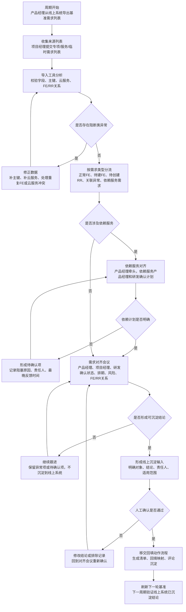
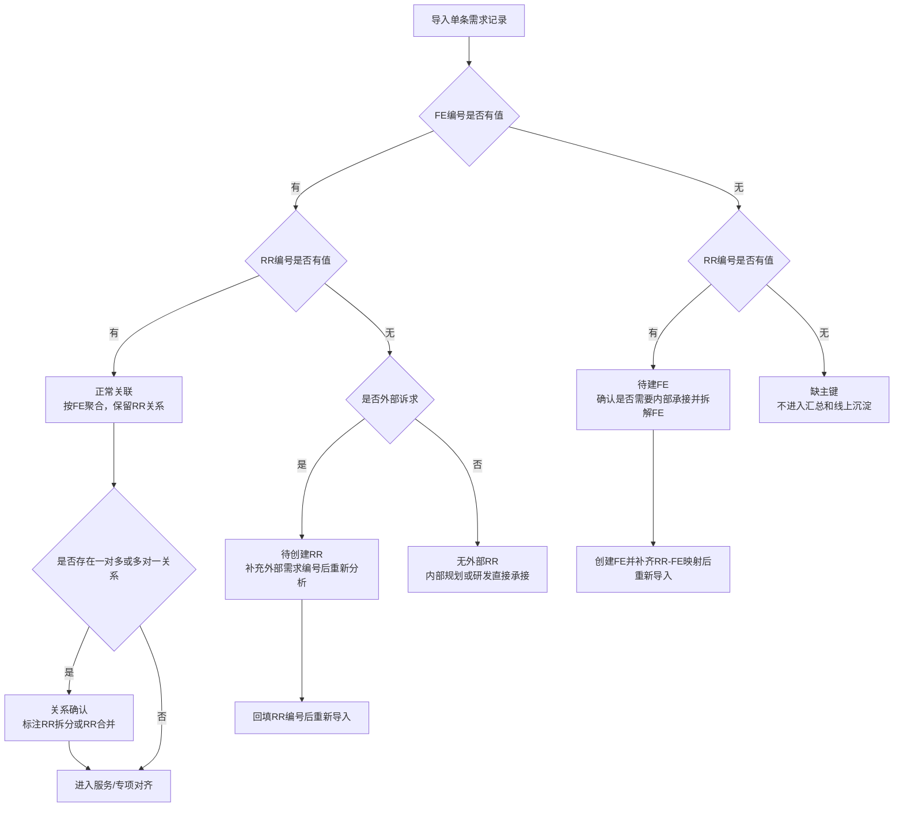
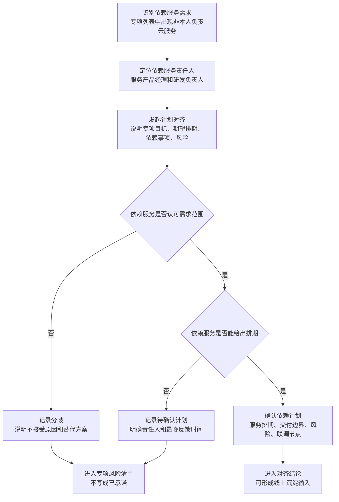

# 需求管理运作规范

## 1. 背景

当前需求管理同时存在两类视角：

1. 服务维度：产品经理负责一个或多个云服务，例如 A、B 服务，需要统一管理这些服务下所有需求的状态、排期、负责人和上线结论。
2. 专项维度：同一个产品经理也可能负责多个专项，专项中可能包含 A、B、C、D 等多个云服务，其中部分服务并不归该产品经理日常负责。

项目经理通常只关注自己负责的专项或项目范围，会基于线上系统导出的需求列表增加自己的管理字段。不同项目经理的关注点不同，扩展列也不一致。

因此，产品经理在实际运作中需要同时维护两套基线：

1. 服务维度基线：面向自己负责的云服务，关注服务内需求是否一致、是否排期、是否上线。
2. 专项维度基线：面向专项目标，关注专项内跨服务需求是否完整、状态是否一致、风险是否可控。

这两套基线最终都必须回到线上需求管理系统中沉淀，避免 Excel 中的阶段性结论和线上系统事实源长期分裂。

## 2. 目标

本规范用于约束外部需求、内部需求、专项需求列表、服务需求列表和线上需求管理系统之间的协作方式。

目标：

1. 外部客户或外部协作方提出的需求，必须使用 `RR编号` 跟踪。
2. 内部研发交付、上线排期、状态跟踪，必须使用 `FE编号` 跟踪。
3. `RR编号` 和 `FE编号` 可以一对一、一对多、多对一关联，但不能混用语义。
4. Excel 需求列表用于阶段性沟通、梳理和对齐；线上需求管理系统仍然是最终事实源。
5. 产品经理必须定期把服务维度和专项维度的对齐结论沉淀到线上系统。
6. 所有线上沉淀必须先形成待确认清单，人工确认后再移交回填动作流程。

说明：本文中的 FE 指内部 Feature 编号。

本文只规定团队需求管理的运作规范、责任边界、准入规则和遵从性要求。具体的 Excel 回填、RR-FE 映射回填、待回刷评论清单生成、线上系统 API 调用等执行动作，不放在本文中展开，统一见 [需求回填动作执行说明](./需求回填动作执行说明.md)。

## 3. 角色与职责

| 角色 | 职责 |
| --- | --- |
| 产品经理 | 维护服务维度基线，维护或统筹专项维度基线，确认最终对齐结论，并决定是否需要线上沉淀。 |
| 项目经理 | 维护自己负责的专项或项目需求列表，补充项目特有字段、风险、会议结论和推进状态。 |
| 研发负责人 | 负责 FE 的研发排期、交付状态、上线节奏和技术风险确认。 |
| 外部客户或外部协作方 | 提出外部需求，需求应通过 RR 进行跟踪。 |
| 线上需求管理系统 | 作为最终事实源，承载 FE、RR、状态、排期、评论和历史记录。 |

## 4. 编号管理规则

### 4.1 RR 编号

`RR编号` 表示外部需求编号。

适用场景：

1. 客户提出需求。
2. 外部项目、外部系统、外部协作方提出需求。
3. 需要面向外部承诺、解释、追踪的需求。

规则：

| 规则 | 要求 |
| --- | --- |
| 外部需求必须有 RR | 外部来源需求进入内部管理前，应先有 `RR编号`。 |
| RR 可以暂时没有 FE | 表示内部还未拆解或未创建 FE，应进入 `待建FE` 工作流。 |
| 一个 RR 可以拆多个 FE | 大需求拆成多个内部交付项，标记为 `RR拆分`。 |
| 多个 RR 可以合并到一个 FE | 多个外部诉求由同一个内部能力承载，标记为 `RR合并`。 |
| RR 不直接代表研发交付 | 研发排期、上线、状态收敛必须落到 FE。 |

### 4.2 FE 编号

`FE编号` 表示内部 Feature 编号，是内部研发交付和线上系统沉淀的主要对象。

适用场景：

1. 内部规划需求。
2. 研发排期与交付跟踪。
3. 上线状态跟踪。
4. 对齐结论线上沉淀。
5. 与 RR 建立关联关系。

规则：

| 规则 | 要求 |
| --- | --- |
| 内部交付必须有 FE | 只要进入研发排期或上线跟踪，就必须有 `FE编号`。 |
| FE 可以没有 RR | 内部规划需求或研发直接承接的需求，可以标记为 `无外部RR`。 |
| FE 是线上沉淀优先主键 | 能定位到 FE 时，优先按 FE 形成线上沉淀结论。 |
| FE 不应被多个来源共同管理 | 同一 FE 出现在多个来源列表时，应作为异常确认。 |
| FE 与云服务归属应稳定 | 同一 FE 出现多个云服务时，应作为严重异常确认。 |

## 5. 需求列表管理规则

### 5.1 基准需求列表

基准需求列表是产品经理从线上系统或内部主数据中导出的基础表。

用途：

1. 作为服务维度和专项维度合并的基础。
2. 判断 FE/RR 是否已存在。
3. 判断来源列表是否修改了不应修改的基准字段。
4. 判断当前线上系统中的状态、排期、负责人是否与沟通结果一致。

要求：

| 字段 | 是否必填 | 说明 |
| --- | --- | --- |
| FE编号 | 必填 | 内部 Feature 编号。基准表中如果重复，必须标记为异常，但不应直接阻断整体分析。 |
| RR编号 | 选填 | 外部需求编号。内部规划需求可以为空。 |
| 云服务 | 必填 | 需求承载的云服务。 |
| 需求标题 | 必填 | 需求的简要描述。 |
| 状态 | 建议必填 | 当前线上或内部状态。 |
| 排期 | 建议必填 | 当前计划排期。 |
| 负责人 | 建议必填 | 当前内部负责人或研发接口人。 |
| 优先级 | 选填 | 团队内部优先级。 |
| 最后更新时间 | 选填 | 用于识别数据新旧，不作为默认线上沉淀字段。 |

### 5.2 服务维度需求列表

服务维度需求列表用于产品经理管理自己负责的云服务。

用途：

1. 查看自己负责的服务下有哪些 FE。
2. 判断服务内需求状态是否一致。
3. 对齐服务内排期、上线、风险和资源投入。
4. 形成面向服务负责人的统一排期基线。

要求：

1. 必须能通过 `FE编号` 聚合。
2. 必须包含 `云服务`。
3. 外部需求需要保留 `RR编号`。
4. 状态、排期、风险、对齐结论等字段可以作为线上沉淀内容来源。

### 5.3 专项维度需求列表

专项维度需求列表用于项目经理或专项负责人管理某个专项中的需求。

特点：

1. 一个专项可能横跨多个云服务。
2. 一个专项中可能包含产品经理负责的服务，也可能包含非自己负责的服务。
3. 项目经理可能增加专项特有字段，例如专项风险、客户影响、会议纪要、里程碑、验收口径。

要求：

1. 专项名称默认来自文件名，不要求 Excel 中固化专项列。
2. 来源列表可以保留项目经理自定义扩展列。
3. 同一个 FE 同时出现在多个专项列表时，需要产品经理确认是否合理。
4. 专项中的非自己负责服务也应进入专项视角，但在“我负责的云服务”视角中区分展示。

## 6. 字段必填规则

### 6.1 通用字段

| 字段 | 基准需求列表 | 来源需求列表 | 说明 |
| --- | --- | --- | --- |
| FE编号 | 必填 | 条件必填 | 内部已有 FE 时必须填写。 |
| RR编号 | 选填 | 条件必填 | 外部需求必须填写。内部规划需求可为空。 |
| 云服务 | 必填 | 必填 | 用于服务维度和专项维度统一。 |
| 需求标题 | 必填 | 建议必填 | 用于人工识别。 |
| 状态 | 建议必填 | 选填 | 可作为对齐结论的一部分。 |
| 排期 | 建议必填 | 选填 | 可作为对齐结论的一部分。 |
| 负责人 | 建议必填 | 选填 | 可作为补充信息。 |
| 对齐结论 | 不要求 | 选填 | 推荐作为线上沉淀核心字段。 |
| 会议纪要 | 不要求 | 选填 | 推荐作为线上沉淀补充字段。 |
| 风险 | 不要求 | 选填 | 推荐作为线上沉淀补充字段。 |
| 客户影响 | 不要求 | 选填 | 推荐作为线上沉淀补充字段。 |
| 备注 | 选填 | 选填 | 只保留，不默认结构化沉淀。 |

### 6.2 FE/RR 填写规则

| 场景 | FE编号 | RR编号 | 处理方式 |
| --- | --- | --- | --- |
| 外部需求已拆内部 FE | 必填 | 必填 | 正常关联。 |
| 外部需求未拆内部 FE | 空 | 必填 | 进入 `待建FE`。 |
| 内部规划需求 | 必填 | 空 | 标记 `无外部RR`。 |
| 研发已直接承接但外部未提 RR | 必填 | 空 | 标记 `无外部RR`。 |
| FE 和 RR 都为空 | 空 | 空 | 无法识别需求，必须修正。 |

## 7. 关联规则

| 场景 | 业务含义 | 处理原则 |
| --- | --- | --- |
| FE 和 RR 都存在 | 外部需求已映射到内部交付项 | 按 FE 聚合，同时保留 RR 关系。 |
| RR 有值，FE 为空 | 外部需求尚未创建内部交付项 | 进入待建 FE 流程。 |
| FE 有值，RR 为空 | 内部规划或研发直接承接 | 允许存在，标记为无外部 RR。 |
| 一个 RR 对多个 FE | 外部大需求拆成多个内部能力 | 保留拆分关系，便于同步评论。 |
| 多个 RR 对一个 FE | 多个外部诉求由一个内部能力解决 | 保留合并关系，便于外部解释。 |
| 同一 FE 出现在多个来源列表 | 可能被多个专项重复管理 | 需要人工确认边界。 |
| 同一 FE 对应多个云服务 | 数据归属冲突 | 需要优先修正。 |

## 8. 线上沉淀原则

### 8.1 为什么需要线上沉淀

Excel 需求列表解决的是阶段性沟通问题，但不能替代线上系统。

需要把对齐结论沉淀到线上系统的原因：

1. 避免对齐结论只留在某个项目经理或产品经理手里的 Excel 中。
2. 避免服务维度基线和专项维度基线长期不一致。
3. 让研发、项目经理、产品经理后续查看同一个线上对象时能看到同一份对齐结论。
4. 利用线上系统评论自带的时间、人员和历史记录，减少后续争议。
5. 让下一轮导出的基准表能反映上一次已经确认过的结论。

### 8.2 什么情况下需要沉淀

以下情况需要形成线上沉淀结论：

1. 产品经理、项目经理、研发已经对齐了状态或排期。
2. 专项维度和服务维度出现不一致，已经确认以某个结论为准。
3. 外部 RR 和内部 FE 的关系已经确认。
4. 待建 FE 已创建，需要把 RR-FE 映射关系沉淀到线上系统。
5. 风险、客户影响、交付口径、上线节奏等信息需要对后续协作可见。
6. 某个需求从专项视角看需要推进，但从服务视角看排期或资源存在差异，已经形成处理结论。

以下情况不应形成最终线上沉淀结论：

1. 仍存在严重异常，例如缺少 FE/RR 主键、云服务冲突。
2. 多个来源共同管理同一 FE，但尚未确认是否重复纳入。
3. 只是工具自动识别出的候选关系，尚未人工确认。
4. 来源列表中的临时备注尚未经过产品经理确认。

### 8.3 沉淀方式边界

当前阶段统一以线上系统评论承载对齐结论，不直接更新结构化字段。

原因：

1. 状态、排期等字段在不同团队中的含义可能不完全一致。
2. 直接更新结构化字段风险较高，容易覆盖线上系统已有事实。
3. 评论更适合沉淀对齐过程、会议结论、风险说明和责任边界。
4. 评论天然带时间和操作者信息，方便追溯。

线上沉淀对象：

| 目标 | 使用场景 |
| --- | --- |
| FE | 内部交付、排期、上线、研发结论。 |
| RR | 外部需求口径、客户承诺、外部解释。 |
| FE + RR | FE 与 RR 关系已确认，且同一结论需要内外部都可见。 |

默认只沉淀到当前对象。只有人工确认需要同步到一层关联对象时，才允许把同一结论同步到直接关联的 FE 或 RR。具体生成评论、选择目标、调用线上接口的动作，按回填动作执行说明处理。

## 9. 待建 FE 与待创建 RR 管理原则

当来源列表中存在 `RR编号` 但没有 `FE编号` 时，应进入待建 FE 管理；当存在明确外部诉求但没有 `RR编号` 时，应进入待创建 RR 管理。

原则：

1. 待建 FE 和待创建 RR 都是管理状态，不是最终结论。
2. 是否创建 RR 或 FE 必须由产品经理确认，不能由工具自动决定。
3. 创建后的编号必须回到需求列表和线上系统中形成一致映射。
4. 未完成编号创建和映射确认前，不应写成已承诺、已排期或已上线。
5. 具体创建、回填、重新分析、生成评论等动作，按回填动作执行说明处理。

待处理清单建议至少包含以下字段：

| 字段 | 说明 |
| --- | --- |
| RR编号 | 外部需求编号。 |
| 云服务 | 需求承载服务。 |
| FE编号 | 已有或创建后的内部 FE。 |
| 需求标题 | 用于人工识别。 |
| 来源列表 | 原始 Excel 文件名。 |
| 来源行号 | 原始行号。 |
| 处理状态 | 待创建RR、待建FE、已创建、无需创建、待确认。 |
| 处理说明 | 创建背景、确认结论或不创建原因。 |

## 10. 端到端需求运作流程

本流程用于把服务维度、专项维度、项目经理来源列表、研发排期和线上系统沉淀串成闭环。团队执行时应按流程推进，不允许跳过阻断类异常直接形成最终沉淀结论。回填动作只在规范流程完成后执行。

### 10.1 总体流程图

### 10.2 执行步骤与决策要求

| 步骤 | 主责人 | 参与人 | 输入 | 执行决策 | 输出 | 遵从性要求 |
| --- | --- | --- | --- | --- | --- | --- |
| 1. 导出基准需求列表 | 产品经理 | 线上系统管理员按需支持 | 线上系统需求数据 | 是否覆盖本周期需要管理的服务和专项范围 | 基准需求列表 | 必须从线上系统导出，不允许用上周期手工改过的 Excel 代替。 |
| 2. 收集来源列表 | 产品经理 | 项目经理、专项负责人 | 专项需求列表、服务需求列表、临时需求列表 | 来源是否覆盖所有本周期需要对齐的专项和服务 | 来源列表集合 | 每个来源列表必须保留原始文件名，作为专项或来源追溯依据。 |
| 3. 导入并校验 | 产品经理 | 工具执行 | 基准表、来源表、字段映射配置 | 是否缺少必填字段、是否存在 FE/RR 都为空、是否缺云服务 | 异常项、正常项、待处理项 | 阻断类异常必须先处理，不允许形成最终沉淀结论。 |
| 4. 主键与关系分流 | 产品经理 | 项目经理、研发负责人 | FE/RR 分析结果 | 需求属于正常 FE、待建 FE、待创建 RR、RR 拆分、RR 合并还是关联异常 | 分流清单 | FE/RR 关系必须显式确认，不能只靠标题相似度默认关联。 |
| 5. 服务维度对齐 | 服务产品经理 | 研发负责人、项目经理 | 属于本人服务的需求清单 | 状态、排期、风险、上线计划是否一致 | 服务维度对齐结论 | 服务维度结论应覆盖本人负责服务下全部相关 FE。 |
| 6. 专项维度对齐 | 专项产品经理或项目经理 | 服务产品经理、研发负责人 | 专项来源列表、专项范围 | 专项目标是否需要该需求，专项计划是否依赖其他服务 | 专项维度对齐结论 | 专项中包含非本人服务时，不得直接删除，应进入依赖服务对齐。 |
| 7. 依赖服务计划对齐 | 发起专项的产品经理 | 依赖服务产品经理、依赖服务研发负责人、项目经理 | 涉及其他服务的 FE/RR、专项里程碑 | 依赖服务是否接受计划、能否给出排期、是否存在风险 | 依赖服务计划结论 | 没有依赖服务负责人确认时，只能标记待确认，不得写成已承诺。 |
| 8. 形成对齐结论 | 产品经理 | 项目经理、研发负责人、依赖服务相关人 | 服务结论、专项结论、依赖服务计划 | 是否已经明确状态、排期、风险、责任人、下一步动作 | 对齐结论字段或会议纪要字段 | 结论必须能回答“谁确认、确认了什么、后续谁负责”。 |
| 9. 形成线上沉淀输入 | 产品经理 | 项目经理、研发负责人、依赖服务相关人 | 已确认结论、FE/RR 关系、适用范围 | 哪些结论需要沉淀到 FE 或 RR，是否涉及一层关联对象 | 线上沉淀输入清单 | 只定义“应沉淀什么”，不在规范流程中描述具体回填动作。 |
| 10. 移交回填动作流程 | 产品经理 | 工具执行、线上系统接口模块 | 线上沉淀输入清单 | 是否满足回填动作执行前置条件 | 待执行回填任务 | 具体生成评论、回填映射、调用 API 见回填动作执行说明。 |
| 11. 闭环验证 | 产品经理 | 项目经理、研发负责人 | 新一轮线上系统导出基准表 | 上次沉淀结论是否能在系统中追溯 | 下一周期基准 | 下一周期必须验证关键结论已进入线上系统。 |

### 10.3 FE/RR 分流处理流程

### 10.4 依赖服务计划对齐流程

依赖服务是指专项中包含的云服务不属于当前产品经理日常负责范围，或者某个 FE/RR 的交付需要其他服务配合。依赖服务不能只在专项表里单方面承诺，必须经过依赖服务负责人确认。

依赖服务对齐必须至少产出以下信息：

| 字段 | 是否必填 | 说明 |
| --- | --- | --- |
| 依赖云服务 | 必填 | 被依赖的服务名称。 |
| 依赖服务产品经理 | 必填 | 对服务范围和优先级负责的人。 |
| 依赖服务研发负责人 | 建议必填 | 对研发排期和交付风险负责的人。 |
| 依赖事项 | 必填 | 需要依赖服务完成的事项。 |
| 计划结论 | 必填 | 已接受、待确认、不接受、需调整范围。 |
| 计划排期 | 条件必填 | 接受计划时必须填写；待确认时填写预计反馈时间。 |
| 风险说明 | 条件必填 | 存在排期、资源、范围风险时必须填写。 |
| 下一步责任人 | 必填 | 后续由谁推进。 |

### 10.5 对齐会议要求

对齐会议不是为了重新维护 Excel，而是为了把分散列表中的差异收敛成可执行结论。

会议前必须准备：

1. 基准需求列表和所有来源列表已经完成导入分析。
2. 阻断类异常已经修正，或者明确列入异常清单。
3. 待建 FE、待创建 RR、依赖服务需求已经形成单独清单。
4. 需要沉淀的结论字段已经明确。
5. 评论模板已经确认。

会议中必须逐项确认：

| 确认项 | 必须回答的问题 | 未确认时处理 |
| --- | --- | --- |
| FE/RR 关系 | 这条需求是否已经有内部 FE？是否关联外部 RR？ | 进入待建 FE、待创建 RR 或关联异常。 |
| 云服务归属 | 这条需求属于哪个云服务？是否涉及依赖服务？ | 缺云服务或云服务冲突时，不进入线上沉淀。 |
| 专项范围 | 这条需求是否属于当前专项目标？ | 不属于时从专项视角排除，但保留原始记录。 |
| 服务计划 | 服务维度是否接受该状态和排期？ | 未接受时记录差异，不写成承诺。 |
| 依赖计划 | 依赖服务是否确认计划？ | 未确认时进入待确认项。 |
| 风险与下一步 | 风险是什么，谁负责，什么时候反馈？ | 没有责任人和时间点时，不形成最终沉淀结论。 |
| 沉淀对象 | 结论应沉淀到 FE、RR，还是 FE 和一层关联 RR/FE？ | 未确认时默认只沉淀当前对象。 |

会议后必须产出：

1. 已确认的对齐结论。
2. 待建 FE 清单。
3. 待创建 RR 清单。
4. 依赖服务待确认清单。
5. 不进入线上沉淀的异常项清单。
6. 线上沉淀输入清单。

### 10.6 线上沉淀准入与禁止规则

只有满足以下条件，才允许形成线上沉淀输入：

1. 至少能定位到一个有效 `FE编号` 或 `RR编号`。
2. `云服务` 已明确。
3. 结论已经由对应责任人确认。
4. 对齐结论中包含明确状态、排期、风险或下一步动作之一。
5. 沉淀对象已经确认。
6. 不存在未解决的云服务冲突、基准重复 FE、多来源共同管理争议。

以下情况禁止形成线上沉淀输入：

| 禁止场景 | 原因 | 正确处理 |
| --- | --- | --- |
| FE/RR 都为空 | 无法定位线上对象 | 补充 FE 或 RR。 |
| 缺少云服务 | 无法确认服务归属 | 补充云服务或使用显式默认值填充。 |
| 依赖服务未确认 | 不能代表其他服务承诺 | 进入依赖服务待确认清单。 |
| 只是会议中的临时意见 | 未形成可追溯结论 | 继续对齐，不沉淀。 |
| 多个来源共同管理同一 FE 且未确认边界 | 可能重复承诺或冲突承诺 | 并排展示来源信息，人工确认后再处理。 |
| 基准 FE 重复且未处理 | 无法确认线上对象唯一记录 | 先处理基准重复项。 |

### 10.7 遵从性检查清单

每个需求管理周期结束前，产品经理必须按以下清单自查。未满足的项需要进入待处理清单，不应在口头确认后直接关闭。

| 检查项 | 合格标准 | 证据材料 | 不合格处理 |
| --- | --- | --- | --- |
| 基准来源 | 基准表来自本周期线上系统导出 | 基准文件、导出时间 | 重新导出基准表。 |
| 来源完整性 | 本周期涉及的专项、服务、临时列表均已纳入 | 来源文件清单 | 补充缺失来源，重新分析。 |
| 主键完整性 | 每条进入汇总的记录至少有 FE 或 RR | 工具异常项清单 | 补充主键，无法补充则排除线上沉淀。 |
| 云服务明确 | 每条进入汇总和线上沉淀的记录都有云服务 | 总览预览、异常项清单 | 补充云服务或显式默认值。 |
| FE/RR 关系确认 | 待建 FE、待创建 RR、RR拆分、RR合并均有处理结论 | 分流清单、会议结论 | 未确认的保留为待处理项。 |
| 依赖服务确认 | 涉及依赖服务的需求有依赖服务负责人结论 | 依赖服务计划结论 | 未确认时不得写成已承诺。 |
| 风险和责任人 | 存在风险的需求有风险说明、责任人和反馈时间 | 对齐结论、风险清单 | 补充责任人和时间点。 |
| 沉淀内容确认 | 线上沉淀输入清单已经人工确认 | 沉淀输入清单、确认记录 | 修改结论内容或排除记录后重新确认。 |
| 线上沉淀验证 | 下一轮基准或线上页面能查到上次评论 | 新基准表、线上评论记录 | 排查回刷失败或目标对象错误。 |

遵从性要求：

1. 没有清单证据的结论，不视为完成。
2. 没有责任人的风险，不视为已对齐。
3. 没有依赖服务确认的跨服务排期，不视为已承诺。
4. 没有线上系统沉淀的 Excel 结论，只能视为阶段性沟通记录。
5. 所有例外处理都必须在异常项或待处理清单中留痕。

## 11. 不规范列表导入时的场景与处理措施

当来源列表不是按统一规范维护时，允许导入，但必须识别问题、给出处理建议，并保留原始数据。导入后的处理不应静默修改原始表，而应通过异常项、待建 FE 管理、待创建 RR 管理和线上沉淀输入清单形成闭环。

### 11.1 主键类问题

| 场景 | 可能原因 | 系统识别 | 建议处理措施 |
| --- | --- | --- | --- |
| FE编号、RR编号都为空 | 手工维护时漏填，或该行不是需求数据 | 缺主键 | 不进入汇总和线上沉淀。要求维护人补充 FE 或 RR；如果不是需求行，应从列表中删除。 |
| 有 RR编号，没有 FE编号 | 外部需求已提出，但内部还没有拆解 FE | 待建FE | 进入待建 FE 清单。产品经理确认是否需要内部承接；需要承接则创建 FE，并回填 RR-FE 映射。 |
| 有 FE编号，没有 RR编号 | 内部规划需求，或研发直接承接但外部未提 RR | 无外部RR | 允许存在。确认是否确实无外部 RR；如存在外部诉求，应补充 RR。 |
| FE编号在基准表中不存在 | 来源列表使用了新 FE，或填写错误 | 基准外FE | 确认该 FE 是否已在线上系统创建。如果已创建但基准表过旧，应刷新基准表；如果填写错误，应修正来源列表。 |
| 基准表 FE编号重复 | 线上导出异常，或历史数据重复 | 基准重复FE | 不阻断分析，但必须优先确认保留哪一行。重复 FE 未处理前，不建议形成该 FE 的线上沉淀结论。 |
| 同一 RR 对应多个 FE | 一个外部需求拆成多个内部交付项 | RR拆分 | 允许存在。需要确认拆分边界，并在线上沉淀结论中说明该 RR 对应哪些 FE。 |
| 多个 RR 对应同一 FE | 多个外部诉求由同一个内部能力解决 | RR合并 | 允许存在。需要在线上沉淀结论中说明覆盖的 RR 范围，避免外部沟通时遗漏。 |
| 同一 RR 在不同来源中对应不同 FE | 来源列表维护不一致，或拆分关系未明确 | RR关联异常 | 进入异常项。产品经理需要确认是合理拆分，还是某个来源填写错误。 |

### 11.2 云服务类问题

| 场景 | 可能原因 | 系统识别 | 建议处理措施 |
| --- | --- | --- | --- |
| 缺少云服务列 | 来源列表不是按服务维度维护，或导出字段不完整 | 缺云服务列 | 要求维护人补充云服务列；如整份文件都属于同一个服务，可以使用显式默认值填充规则。 |
| 云服务为空 | 单行漏填，或来源不清楚 | 云服务为空 | 补充云服务；如果无法确认，先不要形成该行的线上沉淀结论。 |
| 同一 FE 出现多个云服务 | FE 归属被不同来源写成不同服务 | 云服务冲突 | 严重异常。优先以线上系统或服务产品经理确认为准，修正后重新分析。 |
| 专项包含非自己负责服务 | 专项跨服务管理 | 正常专项场景 | 允许进入专项视角；在“我负责的云服务”视角中区分展示，不应直接删除。 |

### 11.3 来源列表扩展字段问题

| 场景 | 可能原因 | 系统识别 | 建议处理措施 |
| --- | --- | --- | --- |
| 多个来源给同一 FE 填了不同扩展信息 | 多个专项重复管理，或同一需求被多方跟进 | 多来源共同管理 | 默认视为高优先级异常。并排展示各来源信息，由产品经理确认是否重复纳入。 |
| 来源列表修改了基准字段 | 项目经理手工改了状态、排期、负责人等字段 | 基准字段变更 | 不直接覆盖基准。将差异作为待确认信息，由产品经理决定是否形成线上沉淀结论。 |
| 来源列表新增了自定义列 | 专项或项目有个性化管理诉求 | 来源列表扩展字段 | 保留并展示。只有用户选择的字段进入线上沉淀输入，其余只进入导出包。 |
| 扩展字段名称不统一 | 不同项目经理命名习惯不同 | 字段不一致 | 先不强制改名。可在评论字段选择中配置多个同义字段，后续再做字段映射能力。 |

## 12. 表格层面的自规范处理要求

为了让需求列表能够被稳定合并、比对和线上沉淀，维护人在提交 Excel 前应先按以下规则自检。

### 12.1 基准需求列表自检

| 检查项 | 要求 | 不符合时处理 |
| --- | --- | --- |
| FE编号 | 必须有列，且每条内部需求应有 FE | 缺列时重新从线上系统导出；重复时先确认保留行。 |
| 云服务 | 必须有列，且不能为空 | 补充服务归属；无法确认时先不要进入线上沉淀。 |
| 需求标题 | 必须有列 | 补充标题，保证人工能识别需求。 |
| RR编号 | 外部需求建议填写 | 如果有外部诉求但无 RR，应补充 RR 或说明无 RR 原因。 |
| 状态、排期、负责人 | 建议填写 | 用于和来源列表对齐，不建议留空。 |

### 12.2 来源需求列表自检

| 检查项 | 要求 | 不符合时处理 |
| --- | --- | --- |
| FE编号 / RR编号 | 至少填写一个 | 两者都为空时，该行无法识别，应补充或删除。 |
| 云服务 | 必须填写 | 如果整份列表属于同一服务，可统一补齐；如果跨服务，逐行填写。 |
| 需求标题 | 建议填写 | 标题为空会影响人工确认，应补充。 |
| 对齐结论 | 需要线上沉淀时建议填写 | 没有对齐结论时，不建议形成线上沉淀输入。 |
| 会议纪要、风险、客户影响、备注 | 按实际需要填写 | 只填写经过确认的信息，避免把临时口径沉淀到线上系统。 |

### 12.3 初始填写建议

来源列表初始填写时，建议按以下优先级填写：

1. 先填写 `云服务`，保证需求能进入服务维度和专项维度。
2. 如果已有内部 FE，填写 `FE编号`。
3. 如果是外部需求，填写 `RR编号`。
4. 如果 RR 已有但 FE 未创建，FE 先留空，后续进入待建 FE 流程。
5. 如果是内部规划需求，填写 FE，RR 可以为空。
6. 需要沉淀到线上系统的结论，填写到 `对齐结论`、`会议纪要`、`风险`、`客户影响`、`备注` 等字段。
7. 未确认的信息不要填写到对齐结论中，避免被误沉淀到线上系统。

### 12.4 不建议的维护方式

| 不建议做法 | 原因 | 替代方式 |
| --- | --- | --- |
| 把多个 FE 写在同一个单元格 | 系统无法稳定按 FE 聚合 | 一行一个 FE；同一 RR 拆多个 FE 时拆成多行。 |
| 把云服务写在标题或备注里 | 系统无法稳定识别云服务 | 单独维护 `云服务` 列。 |
| 手工修改基准字段后不说明 | 容易造成基准和来源冲突 | 修改结论写到扩展字段或对齐结论中。 |
| 用颜色、批注表达关键状态 | 程序难以稳定解析 | 用明确字段表达，例如状态、风险、对齐结论。 |
| 删除 FE/RR 后只保留自然语言标题 | 无法可靠关联线上系统 | 至少保留 FE 或 RR 一个主键。 |

## 13. 后置处理原则

导入后的处理不应只停留在“报错”。规范层面需要明确问题归类、处理责任和下一步方向；具体清单生成、编号回填、评论生成和线上接口调用，统一放到回填动作执行说明中。

### 13.1 更好的用户提示

| 问题 | 应提示用户什么 | 规范层面的下一步 |
| --- | --- | --- |
| RR 有值但 FE 为空 | 这是外部需求尚未拆解为内部交付项 | 进入待建 FE 管理，由产品经理确认是否内部承接。 |
| FE 有值但 RR 为空 | 这是内部规划需求或无外部 RR 需求 | 提示确认是否确实无 RR；如有外部诉求，补充 RR。 |
| 缺少云服务 | 无法判断需求属于哪个服务 | 提示补充云服务，或配置整份文件默认云服务。 |
| 多来源共同管理同一 FE | 可能被多个专项重复纳入 | 并排展示不同来源的扩展信息，提示确认边界。 |
| 基准重复 FE | 基准数据存在重复 | 提示先确认基准保留行，再形成线上沉淀结论。 |

### 13.2 待创建 RR 管理原则

当来源列表中出现明确外部诉求但没有 RR 时，应进入待创建 RR 管理。

规范要求：

1. 是否创建 RR 由产品经理确认。
2. 创建 RR 前应明确外部来源、云服务、需求标题和客户影响。
3. 未创建 RR 前，不应把该诉求写成已经纳入正式外部需求管理。
4. 创建后的 RR 编号必须回到来源列表或映射清单中，保证下一次分析可关联。
5. 具体清单字段、回填方式和重新分析动作见回填动作执行说明。

### 13.3 待建 FE 管理原则

当 RR 已存在但 FE 为空时，应进入待建 FE 管理。

规范要求：

1. 是否拆解 FE 由产品经理和研发负责人共同确认。
2. 一个 RR 可以拆多个 FE，但必须说明拆分边界。
3. 多个 RR 可以合并到一个 FE，但必须说明覆盖范围。
4. 未创建 FE 前，不应写成内部已排期或已承诺交付。
5. 创建后的 FE 编号必须与 RR、云服务建立映射。
6. 具体创建后回填、映射导入和评论生成动作见回填动作执行说明。

### 13.4 能力边界

| 能力 | 属于运作规范 | 属于回填动作执行说明 |
| --- | --- |
| 判断是否需要创建 RR | 是 | 否 |
| 判断是否需要拆解 FE | 是 | 否 |
| 判断依赖服务是否已确认 | 是 | 否 |
| 判断是否允许线上沉淀 | 是 | 否 |
| 生成待创建 RR 清单 | 否 | 是 |
| 生成待建 FE 清单 | 否 | 是 |
| 回填 RR-FE 映射 | 否 | 是 |
| 生成待回刷评论 | 否 | 是 |
| 调用线上系统 API 写评论 | 否 | 是 |

## 14. 后续待讨论事项

1. 是否要强制所有外部 RR 在创建 FE 前进入统一待分解池。
2. 状态、排期、负责人未来是否允许结构化字段沉淀。
3. 多来源共同管理同一 FE 时，是否允许用户确认后进入线上沉淀。
4. 基准重复 FE 是否只按 FE 判断，还是结合云服务、RR编号进一步判断。
5. 专项维度和服务维度冲突时，是否需要设置优先级规则。
